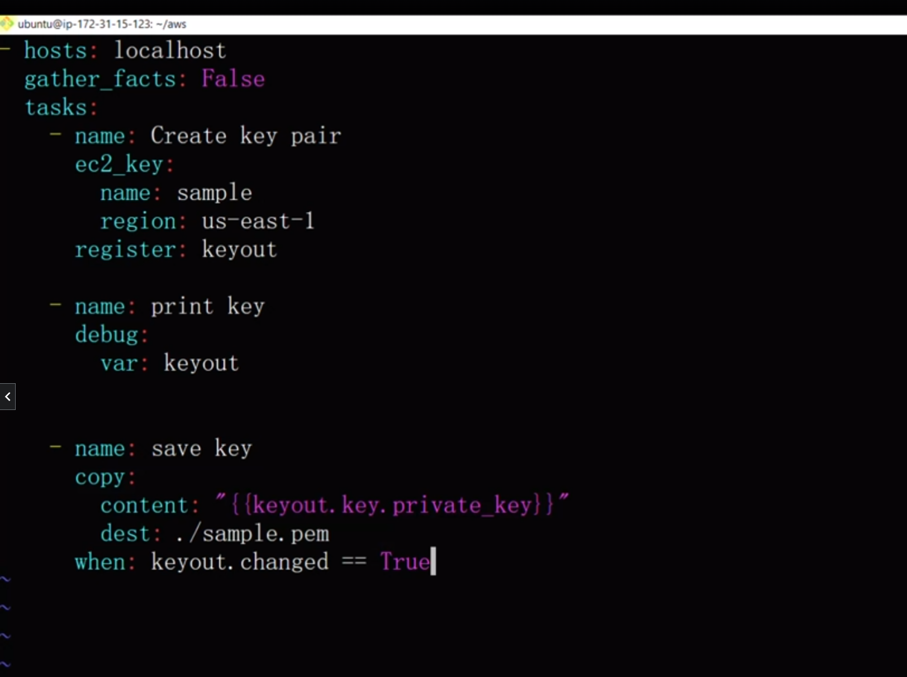

# 🅰️ Ansible

## 🔐 SSH permission 
- When you try to SSH any machine then your HOST machine prompt you about your permission with fingure print. Do you know this machine and you really want to connect to it? "YES"
- And if you type YES then it stores the fingure print of that file in your machine so when you try to ssh second time it won't ask you for permission.
- Location of file which stores the figure print: ./ssh/known_host 
- If you remove everything from this file then it will again prompt you for your permission 

## ⚒️ Installation  of Ansible

```sh
#!/bin/bash
sudo apt update -y
sudo apt install software-properties-common -y
sudo add-apt-repository --yes --update ppa:ansible/ansible
sudo apt install ansible -y
```

## ✅ Check Installation 
```sh
$ ansible --version
```

## 🧑‍🏫 Guide
➡️ Default inventory file can be found in **/etc/ansible/host**

➡️ Default ansible.cfg file can be found in **/etc/ansible/ansible.cfg**
above file contain command to generate ANSIBLE.CFG file
```sh
$ ansible-config init --disabled -t all > ansible.cfg
```
above command generate configuration file.
we want to change do below change. OTHER WISE IT WILL ASK or PROMPT YOU AT LOGIN TIME
**host_key_checking=False**
Its' better if you create configuration file in your workspace or directory using ABOVE COMMAND.


## 🌟 Ansible.cfg file and ordering

1) ANSIBLE_CONFIG(environment variable)
2) ansible.cfg (in the current directory)
3) ~/ansible.cfg(in home directory)
4) /etc/ansible/ansible.cfg
```sh
[defaults]
host_key_checking=False
inventory = ./inventory
forks = 5
log_path = /var/log/ansible.log

[privilege_escalation]
become=True
become_method=sudo
become_ask_pass=False
```

## 📃Modules
- ➡️ ping (test ssh)
- ➡️ yum   
- ➡️ setup
- ➡️ copy       -> It's Just dump the file 
- ➡️ template   -> It resolves the variable and then dump the file

## 🚁Ad-hoc commands & it's examples

### YUM
```sh
$ ansible -i inventory -m ansible.builtin.yum -a "name=httpd state=present" web01 --become

$ ansible -i inventory -m ansible.builtin.yum -a "name=httpd state=present" webserver --become

$ ansible -i inventory -m ansible.builtin.yum -a "name=httpd state=absent" webserver --become
```
### SERVICE

```sh
$ ansible -i inventory -m ansible.builtin.service -a "name=httpd state=started enabled=yes" webserver --become
```

### COPY
```sh
$  ansible -i inventory -m ansible.builtin.copy -a "src=index.html dest=/var/www/html/index.html" webserver --become
```

### SETUP (fact variable)
```sh
$ ansible -m setup web01
```


## ⛹️‍♂️ Exercise 

- Exercise 1 ➡️ learned about inventory file.  Groups and hosts

- Exercise 2 ➡️ Ad - hoc command

- Exercise 3 ➡️ learned about Writing playbook

- Exercise 4 ➡️ COPY module with playbook (copy file form control-machine to the worker node)

- Exercise 5 ➡️ install mariadb-server on dbserver and create database
**Note: socket files in linux is used to connect Process together. Maybe we need to tell ansible where to connect to MySQL services**
		
- Exercise 6 ➡️ learned about ansible.cfg file and it's ordering 

- Exercise 7 ➡️  learned about the VARIABLEs (Introduction to the variable)

- Exercise 8 ➡️ learned about the INVENTORY BASED VARIALBE (group_vars/all, group_vars/groupname                                                                    etc…..)

- Exercise 9  ➡️ want to understand the precedence of VARIABLE (priority of the files )

- Exercise 10 ➡️ learned about fact variable and (setup modules)

- Exercise 11 ➡️ learned about the decision making using the fact variable

- Exercise 12 ➡️ learned about the Loops

- Exercise 13 ➡️ learned about Template modules, file, copy 

- Exercise 14 ➡️ learned about Handlers etc.. (everytime services restarted)

- Exercise 15 ➡️ learned about ROELS

## 🥹 Variable can be define in
- can be passed in command line (Highest priority )
- Playbook
- Inventory based
    - Inventory file
    - group_vars/all
    - group_vars/groupname
    - host_vars/hostname
- Roles
    - role/Name_of_Role/vars/main.yml
    - role/Name_of_Role/default/main.yml

## 🔢 Variables precedence

➡️ Argument in command line ➡️ Inventory ➡️ Host_vars/hostname ➡️ Group_vars/group_name ➡️ Group_vars/all


## 👮 Handlers

Sometime you want to do execute some task on occurrence of some specific  EVENT
e.g When there is changes in config file then only RESTART THE service otherwise NOT

## 🎭 Role

Ansible roles is to the simplify the ANSIBLE PLAYBOOK
To make code more manageable, we can use the ansible roles
main perpose reusability

### 💭 How to create roles

```$ cd workspace```

Here you have ansible.cfg, your playbook, inventory file, key.pem file, etc

```
$  mkdir roles

$ cd roles

$ ansible-galaxy init <NAME_OF_THE_ROLE>

```

USE FULL COMMAND 
```:%s/^    //```


### 💫 Before Roles


### 💫 After using roles


### 💫 Playbook look like 


### 💸 NOTE
Template with .j2  extension
You don’t have to specify files location or template location in tasks. Ansible is smart enough To take care of that


## 🌤️ To Create AWS resources using Ansible

**Please store access key id and secret key id in .bashrc file**
```sh
export AWS_ACCESS_KEY_ID='DFSDF4R2342'
export AWS_SECRET_KEY-'abc123'
```
Open .bashrc

```sh
Vim .bashrc
```
Put variables into it

```sh
Source .bashrc
```

### 📘 Playbook should be 



